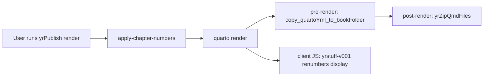

# SPEC-initial-yrPublish-design-0.0.1-v001.qmd

## Purpose

Design `yrPublish` v0.0.1 as a thin bash CLI wrapper around Quarto that recreates the behavior of the pre-`yrPublish` toolset (yrPublish v0.0.0).

This version focuses on preserving existing custom behavior (custom chapter numbering via `yrChapterNumber`, renumbering via `yrRenumberChapters`, and the runtime DOM renumbering via `yrstuff-v001.js`).

This design is grounded in the pre-`yrPublish` working Quarto project found at [`sampleBooks/DataManagementUsingRSrc/DataManagementUsingRSrc-v0.0.0/`](../sampleBooks/DataManagementUsingRSrc/DataManagementUsingRSrc-v0.0.0/), which contains the v0.0.0 scripts/assets we vendor unchanged into new yrPublish projects for v0.0.1.

## Scope

In scope:

- A single bash CLI entrypoint named `yrPublish` with a small set of subcommands.
- A project scaffolding workflow: `yrPublish create-project ...`
- Render/preview workflows that pin and use the correct Quarto and yrPublish tooling.
- Chapter-number workflows:
  - renumber sequentially in `_quarto.yml`
  - apply chapter numbers into `.qmd` files
  - ensure chapter-number display is corrected at runtime in the generated HTML
- Version pinning:
  - record which `yrPublish` version the target project expects
  - vendor/copy the matching `yrPublish` tooling into the project repo
- A version-reporting interface:
  - show the running `yrPublish` executable version
  - show the target project’s locked `yrPublish` version
  - warn on mismatch
- Documentation of example/test strategy (describe-only in this spec; no scaffolding yet).

Out of scope:

- Rewriting the existing v0.0.0 scripts/assets in-place.
- Implementing v0.0.2 enhancements (these may change how scripts are managed).

## Functional Requirements

### Non-negotiable checklist (v0.0.1)

These items must all be implemented for `yrPublish` v0.0.1 to be considered complete:

- Provide a single bash CLI named `yrPublish` with the required subcommands (including `help` / `help <subcommand>`).
- Implement version pinning and repo-local locking via `.yrPublish/yrPublish.lock`.
- During `yrPublish create-project`, vendor/copy the pinned yrPublish implementation assets into `.yrPublish/<locked-version>/...`.
- Implement dependency isolation by pinning Quarto in `.yrPublish/config/quarto-version.txt` and using a vendored Quarto install under `.yrPublish/tools/quarto/<version>/bin/quarto`.
- Implement `yrPublish version-cli` (baked into the running executable/script) and `yrPublish version-project <project-path>` (read from the project’s `.yrPublish/yrPublish.lock`).
- Warn whenever the running `yrPublish` tool version and the project-locked `yrPublish` version differ (for any subcommand that operates on a project).
- Implement chapter-number workflows:
  - `yrPublish renumber-chapters` updates `# yrChapterNumber <n>` comments in `_quarto.yml` sequentially.
  - `yrPublish apply-chapter-numbers` updates `<yrChapterNumber>...</yrChapterNumber>` in `.qmd` files.
  - `yrPublish render` automatically runs `apply-chapter-numbers` before invoking Quarto.
- Treat the v0.0.0 scripts/assets as unchanged resources: do not edit them in-place for v0.0.1; only vendor/copy them.

### Command surface

`yrPublish` is a bash CLI with subcommands (and `help` for each subcommand).

Required subcommands/options:

- `yrPublish create-project <project-name> [--type book|website|...]`
- `yrPublish render [<project-path>]`
- `yrPublish preview [<project-path>]`
- `yrPublish renumber-chapters [<project-path>]`
- `yrPublish apply-chapter-numbers [<project-path>]`
- `yrPublish help`
- `yrPublish help <subcommand>`

Version/reporting subcommands (new in v0.0.1):

- `yrPublish version-cli`
  - Reports the version baked into the running `yrPublish` executable/script.
- `yrPublish version-project [<project-path>]`
  - Reports the `yrPublish` version required by the target project by reading `.yrPublish/yrPublish.lock`.

Version consistency behavior:

- `yrPublish version-cli` always works without probing the target repo.
- `yrPublish version-project` fails clearly if the target project has no `.yrPublish/yrPublish.lock`.
- Any `yrPublish` subcommand that operates on a project should warn if:
  - `version-cli` (running tool version) differs from
  - `version-project` (locked project-required version).

### Pinned assets and v0.0.0 reuse (unchanged resources)

All supporting tools/assets used to implement yrPublish v0.0.1 are to be placed in a `.yrPublish/` folder at the root of each project created by `yrPublish`.

For v0.0.1, the v0.0.0 code is reused unchanged by vendoring it into the project for the locked version.

The v0.0.0 scripts/assets to vendor (copied unchanged) include:

- `yrChapterNumber-v004.sh`
- `yrRenumberChapters-v005.sh`
- `yrBuildQuarto-v004.sh`
- `copy_quartoYml_to_bookFolder-v001.R`
- `yrZipQmdFiles.R`
- `yrstuff-v001.js`
- `yrStyles-main-v001.css`
- `yrNocacheHeaders-v001.html`

### Render pipeline behavior

`yrPublish render` must apply chapter numbers before calling Quarto, and the generated site must run runtime renumbering at view time.

Proposed pipeline:

1. `yrPublish apply-chapter-numbers` (so `.qmd` files contain updated `<yrChapterNumber>...</yrChapterNumber>` content)
2. Call the pinned local Quarto binary to perform the render
3. Rely on the project’s `_quarto.yml` hooks:
   - `pre-render` to ensure `_quarto.yml` is copied into `_book/` (so the runtime JS can fetch it)
   - `post-render` to create `.qmd.zip` artifacts in `_book/`
4. Runtime JS (`yrstuff-v001.js`) overwrites displayed chapter/section numbering using the mapping found in `_book/_quarto.yml`.

Mermaid overview:



### Applying chapter numbers

`yrPublish apply-chapter-numbers` must:

- Parse `_quarto.yml` chapter mappings that use `# yrChapterNumber <n>` comments.
- Update the corresponding `.qmd` files’ `<yrChapterNumber>...</yrChapterNumber>` elements.

Help text requirement:

- The help for `apply-chapter-numbers` must clearly state that this step is also run automatically during `render`.

## Version pinning and repo-local locking

### Lockfile

Each yrPublish project repo must record which `yrPublish` version it expects in:

- `.yrPublish/yrPublish.lock`

This file contains the locked `yrPublish` version (exact string).

### Vendoring implementation assets

During `yrPublish create-project`:

- `yrPublish` copies/vends the yrPublish implementation assets for the locked version into:
  - `.yrPublish/<locked-version>/...`
- subsequent `render` / `preview` / etc uses the pinned assets from `.yrPublish/<locked-version>/...` rather than whatever scripts happen to exist globally.

This design must remain robust even if the developer upgrades the global `yrPublish` executable, because the project always uses the pinned toolset that matches its locked version.

## Dependency isolation mechanism

Document and implement one concrete approach:

- Pin a Quarto version in `.yrPublish/config/quarto-version.txt` (written/templated by `create-project`).
- `yrPublish` uses a local vendored Quarto install under `.yrPublish/tools/quarto/<version>/bin/quarto`.
- A wrapper/shim ensures `yrPublish` subcommands call the vendored binary (not a random `quarto` from PATH).

## Proposed file/project layout (per created project)

```text
repo-root/
  _quarto.yml                      # Quarto book config for the product
  ...content files...

  .yrPublish/
    yrPublish.lock                # locked yrPublish version expected by this repo
    config/
      quarto-version.txt
    tools/
      quarto/<version>/bin/quarto
    <locked-version>/
      yrChapterNumber-v004.sh
      yrRenumberChapters-v005.sh
      yrBuildQuarto-v004.sh
      copy_quartoYml_to_bookFolder-v001.R
      yrZipQmdFiles.R
      yrstuff-v001.js
      yrStyles-main-v001.css
      yrNocacheHeaders-v001.html
```

## Examples and tests (describe-only for v0.0.1)

### Example project(s)

Create one or more example projects under `examples/` that exercise all features, including:

- `renumber-chapters` + `apply-chapter-numbers`
- `render` output demonstrating runtime chapter numbering correction
- verification that `_book/_quarto.yml` exists and that `.qmd.zip` artifacts are produced (if applicable to the existing wiring)

Each example must include a `README.md` describing how to run it.

### Automated test strategy

Recommend (and document) a mix of:

- CLI unit tests:
  - `help` text correctness
  - version subcommand behavior:
    - `version-cli` returns the baked executable version
    - `version-project` reads `.yrPublish/yrPublish.lock`
    - mismatch warning occurs when tool version differs from project lock
- File-mutation tests:
  - `apply-chapter-numbers` updates `<yrChapterNumber>` in targeted `.qmd` files
  - `renumber-chapters` updates `# yrChapterNumber` comments in `_quarto.yml`
- Integration tests (optional for v0.0.1, but documented):
  - run `render` in a temp directory with vendored assets
  - assert expected artifacts exist in `_book/`

## Acceptance Criteria

- `yrPublish` subcommands exist and provide help output for each.
- `yrPublish render` applies chapter-number renumbering and produces a rendered site where chapter numbers are corrected at runtime.
- `yrPublish create-project` creates `.yrPublish/` with:
  - `.yrPublish/yrPublish.lock`
  - pinned/vendored implementation assets under `.yrPublish/<locked-version>/`
  - pinned Quarto under `.yrPublish/tools/quarto/...`
- `yrPublish version-cli` and `yrPublish version-project` both work and mismatch is warned.

## Risks and mitigations

- Risk: project depends on runtime fetching of `_book/_quarto.yml` via JS.
  - Mitigation: `pre-render` must ensure `_quarto.yml` is copied into `_book/` before the browser loads runtime JS.
- Risk: global tool upgrades break old projects.
  - Mitigation: use `.yrPublish/yrPublish.lock` and vendor/copy matching yrPublish assets into `.yrPublish/<locked-version>/`.

